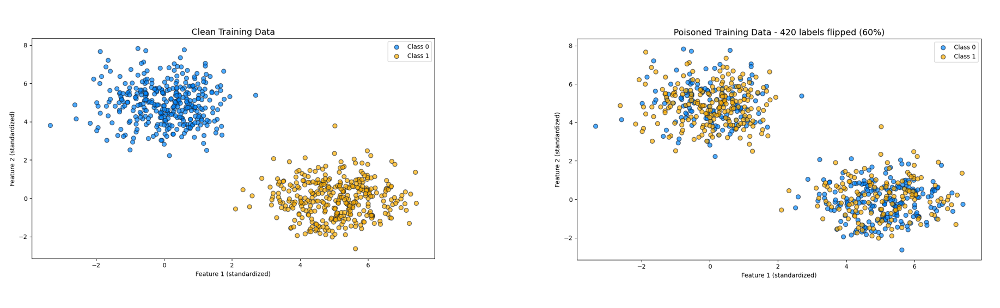
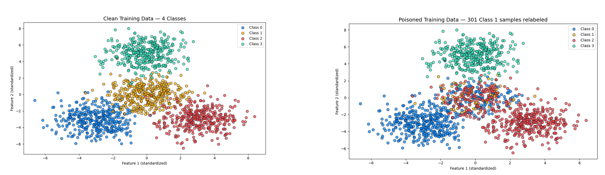

# Label Flipping Attacks

Two implementations of label flipping attacks against logistic regression classifiers - from a simple binary case to a more advanced targeted multi-class version.

---

## What Is a Label Flipping Attack?

A label flipping attack is one of the simplest forms of data poisoning. Instead of modifying the input features, the attacker changes the **labels** (the correct answers the model is supposed to learn from).

The model has no way to tell the difference between a correct label and a flipped one. It simply trains on whatever data it receives.

```
Clean training:   feature → correct label  → model learns right boundary
Poisoned training: feature → wrong label   → model learns wrong boundary
```

In many systems, labels come from sources that are not fully trusted or verified like crowdsourced platforms, web scraping, federated participants, or third-party annotation services.

---

## Notebooks

### 1. `basic_label_flipping.ipynb` - Random Label Flipping (Binary Classifier)

A straightforward attack on a binary logistic regression classifier.

- **Target:** all training samples, randomly selected
- **Method:** flip 60% of labels (0→1, 1→0)
- **Effect:** model accuracy drops from ~99% to near 0%
- **Key insight:** flipping more than 50% makes the incorrect labels dominate - the model confidently learns the wrong boundary





---

### 2. `targeted_label_flipping.ipynb` - Targeted Label Flipping (4-Class OvR Classifier)

A more advanced, surgical version of the attack targeting only one class in a 4-class setting.

- **Target:** Class 1 only
- **Method:** flip 80% of Class 1 labels - half to Class 0, half to Class 2
- **Effect:** Class 1 recall drops significantly; overall accuracy stays high
- **Key insight:** keeping 20% of Class 1 labels intact ensures the model still trains as a 4-class classifier (flipping all of them might be suspicious for the defenders)





|  | Basic | Targeted |
| --- | --- | --- |
| Classes | Binary (2) | Multi-class (4) |
| Which labels flipped? | Random across all | Class 1 only |
| Overall accuracy | Drops to near zero | Stays relatively high |
| Detection difficulty | Medium | Harder - looks like a data quality issue |

---

## Prerequisites

Both notebooks require:

```bash
pip install numpy matplotlib scikit-learn jupyter
```

## Running the Notebooks

```bash
jupyter notebook basic_label_flipping.ipynb
jupyter notebook targeted_label_flipping.ipynb
```

> **Note:** The dataset files are not included in this repository as they are proprietary to the HTB Red Teamer course. To reproduce the notebooks, provide your own dataset in `.npz` format.
> 
> 
> Basic notebook expects keys: `Xtr`, `ytr`, `Xte`, `yte`
> 
> Targeted notebook expects keys: `X_train`, `y_train`, `X_test`, `y_test`
> 

---

## Defenses

- **Label consistency checks** - flag samples where the label contradicts the feature values
- **Confident learning** - automatically detect likely mislabeled samples before training
- **Data provenance** - track the source of every training label
- **Per-class performance monitoring** - a sudden drop in one class recall is a red flag
- **Robust loss functions** - training objectives less sensitive to noisy labels

---

## References

- [MITRE ATLAS - Poison Training Data](https://atlas.mitre.org/techniques/AML.T0020)
- [OWASP Machine Learning Security Top 10](https://owasp.org/www-project-machine-learning-security-top-10/)
