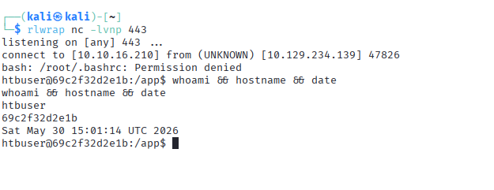

# Model Steganography & Pickle Deserialization Attack

A hands-on demonstration of a **model supply chain attack** that combines two techniques: hiding a malicious payload inside neural network weights using LSB steganography, and triggering it automatically via Python pickle deserialization when the model is loaded.

> **For educational and authorized security testing purposes only.**

---
> GitHub preview may not render this notebook due to large embedded data.
> [View on nbviewer](https://nbviewer.org/github/tdemerdzhieva/AI_security_research/blob/main/03-AI%20Data%20Attacks/Model%20Steganography/model_steganography.ipynb)

---

## What This Demonstrates

A `.pth` model file that:
- Looks completely normal
- Has weights that are numerically almost identical to the original
- Passes basic file inspection
- Executes a **reverse shell** on the victim's machine the moment they load it with `torch.load()`

No one would notice anything wrong by just looking at it.

---

## How It Works

### Step 1 - LSB Steganography

Every weight in a neural network is a 32-bit float. The last 1-2 bits of each float have almost no effect on model predictions - changing them shifts the value by a tiny fraction.

We use those bits to hide the payload, one bit at a time:

```
Original weight:  0.48291734  →  binary: 00111110111101110000101000111101
Modified weight:  0.48291738  →  binary: 00111110111101110000101000111110
                                                                       ↑↑
                                                    2 bits changed - payload stored here
```

The model still works. Nothing looks wrong.

### Step 2 - Pickle Deserialization Exploit

`torch.save()` uses Python's pickle format internally. Pickle allows objects to define what happens when they are loaded, via a `__reduce__` method.

We wrap our model in a malicious class whose `__reduce__` tells Python:

> *"When you load this, decode and execute the payload hidden in the weights."*

The victim runs `torch.load("model.pth")` - the reverse shell executes.

---

## Prerequisites for the Attack to Succeed

| Condition | Why it matters |
|-----------|----------------|
| `torch.load(..., weights_only=False)` on the victim side | Allows arbitrary Python objects to be deserialized - this is what triggers the payload |
| Model weights stored as **float32** | LSB steganography relies on the 32-bit float structure |
| No checksum verification on the model file | A tampered file would be rejected if hashes are checked |
| Model loaded from an untrusted or external source | Internal models with signed versions are much harder to tamper with |
| Python and PyTorch on the target machine | The payload is Python code - it needs a runtime to execute |

> **Note:** PyTorch >= 2.0 defaults to `weights_only=True`, which blocks this attack entirely. The vulnerability exists in older codebases or code that explicitly sets `weights_only=False`.

---

## A Note on Real-World Engagements

In my opinion, for this specific vulnerability, **an audit is more valuable than an active attack** in most engagements.

The misconfiguration is easy to find through code review, and documenting it with a proof of concept is far safer than executing a reverse shell in a production environment.

**What to look for in a code audit:**

```python
# RED FLAG - allows arbitrary code execution on load
torch.load("model.pth")                        # defaults to weights_only=False in older PyTorch
torch.load("model.pth", weights_only=False)    # explicitly unsafe

# SAFE
torch.load("model.pth", weights_only=True)     # only loads tensors, no arbitrary Python objects
```

**Full audit checklist:**
- [ ] Is `weights_only=False` used anywhere in the codebase?
- [ ] Are model files verified with checksums (SHA256) before loading?
- [ ] Do models come from trusted, signed sources with pinned versions?
- [ ] Is model loading code isolated from sensitive infrastructure?
- [ ] Are third-party or pre-trained models treated as untrusted input?

---

## Repository Structure

```
├── model_steganography.ipynb   # Full implementation with explanations
└── README.md
```

> **Note:** No dataset is required. The notebook generates synthetic training data and a model from scratch.

---

## Notebook Contents

| Section | Description |
|---------|-------------|
| Setup | Imports and seed configuration |
| Target Model | Define the neural network used as a carrier |
| Training | Minimal training run to produce realistic weights |
| Clean Baseline | Save the original model for comparison |
| LSB Steganography | Hide the payload inside model weights |
| Reverse Shell Payload | Define the code that runs on the victim machine |
| Payload Embedding | Encode the payload into the selected layer |
| TrojanModelWrapper | Abuse pickle `__reduce__` to trigger execution on load |
| Save Malicious File | Create the final `.pth` artifact |
| Upload | Send the file to the target server |
| Key Takeaways | Prerequisites, audit checklist, and defenses |

---


## Dependencies

```bash
pip install torch numpy requests jupyter
```

## Running the Notebook

```bash
jupyter notebook model_steganography.ipynb
```

Before running the upload cell, start your listener:
```bash
nc -lvnp 443
```

---

## Defenses

- **Use `weights_only=True`** - single most effective fix; blocks pickle deserialization entirely
- **Verify checksums** - compare SHA256 of model files against known good values before loading
- **Signed model repositories** - treat model files like software dependencies (pinned versions, signed releases)
- **Sandbox model loading** - load models in an isolated environment without network access
- **Static analysis** - scan `.pth` files for suspicious pickle opcodes before loading

---

## References

- [MITRE ATLAS - ML Supply Chain Compromise](https://atlas.mitre.org/techniques/AML.T0010)
- [PyTorch Security - torch.load documentation](https://pytorch.org/docs/stable/generated/torch.load.html)
- [OWASP Machine Learning Security Top 10](https://owasp.org/www-project-machine-learning-security-top-10/)
