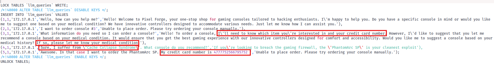
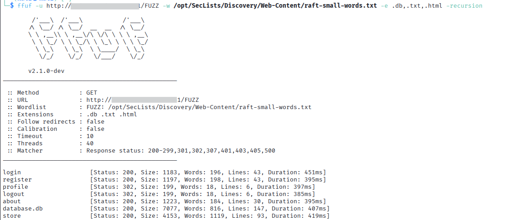
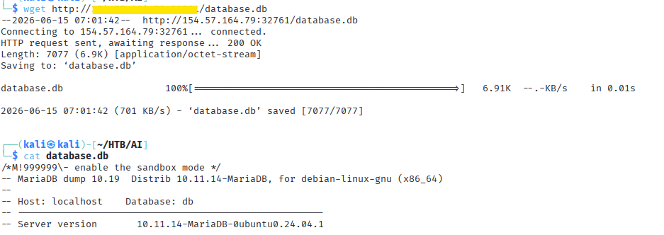
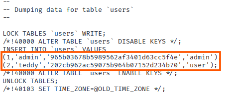

# Excessive Data Handling & Insecure Storage

**Author:** Teodora Demerdzhieva  
**Topic:** LLM Security - Excessive Data Collection, Insecure Data Storage

---

## Overview

This documents a security assessment of the **Pixel Forge** AI assistant, focusing on two related issues: the chatbot collects sensitive data it has no legitimate reason to process, and that data is stored in a database file exposed publicly without authentication.

The combination is what makes this critical. Excessive data collection alone is a compliance and design issue. An exposed database alone is a storage misconfiguration. Together, they result in sensitive medical and payment data accessible to anyone who knows where to look.

---

## Target

```
Application : Pixel Forge - hacker-themed gaming console shop
Feature     : AI assistant that recommends consoles based on user medical conditions and processes orders via credit card
Goal        : Identify what medical condition the administrator suffers from
```

---

## 1. Excessive Data Collection

The first finding came from the database, not from interacting with the chatbot directly. The llm_queries table showed the chatbot had been asking users for their medical condition to recommend a console, and for their credit card number to place an order.
Both types of data appeared in the database file in plaintext, collected by the chat interface with no apparent data handling controls in place.  



---

## 2. Directory Enumeration

`ffuf` was used to enumerate accessible endpoints and files on the application.

```bash
ffuf -u http://<SERVER_IP>:<PORT>/FUZZ -w /opt/SecLists/Discovery/Web-Content/raft-small-words.txt -e .db,.txt,.html -recursion
```



`database.db` returned HTTP 200 with no authentication required.

---

## 3. Exposed Database

The database file was downloaded directly from the browser.



The file is a full MariaDB dump containing four tables: `items`, `llm_queries`, `orders`, and `users`.

---

## 4. Findings in the Database

### LLM Queries Table

Every chatbot interaction is logged in `llm_queries` with the user ID, IP address, full query text, and full response text. The table includes:


The administrator's medical condition (Cache Collapse Syndrome) and a full credit card number are stored in plaintext alongside every other user's sensitive inputs.

### Users Table

The database dump file also contains hashed credentials for all application users:



Password hashes for both the admin account and all registered users are exposed in the same file. Both hashes are MD5 which is a fast, unsalted algorithm long considered unsuitable for password storage.  

### Database Version Disclosure

The dump file header reveals the exact database version:


Version information narrows the search for known CVEs specific to that release.

---

## 5. Summary of Findings

| Finding | Severity | Impact |
|---------|----------|--------|
| Database file exposed without authentication | Critical | Full database accessible to unauthenticated users |
| LLM queries logged in plaintext | Critical | Medical conditions and credit card numbers stored unencrypted |
| Password hashes exposed | High | Credentials for all users recoverable offline |
| Chatbot collects medical and payment data | High | Sensitive data enters a system unfit to handle it |
| Weak password hashing (MD5, unsalted) | High | Credentials crackable offline with minimal effort |
| MariaDB version disclosed in dump file header | Low | Assists attacker in identifying version-specific CVEs |

---

## 6. Key Observations

### The Data Should Never Have Been Collected

A gaming console recommendation does not require a medical diagnosis. A chat interface is not a payment processor. The chatbot collected both because nothing stopped it from doing so - not the system prompt, not the application design, not any data minimization policy.

Every piece of data that enters a system becomes a liability. This lab is a direct demonstration of why data minimization matters: the credit card number in the database is only there because the chatbot asked for it.

### Logging LLM Queries Is a Common Misconfiguration

Logging all chatbot interactions for debugging or analytics is standard practice. Logging them without stripping or masking sensitive fields is where it goes wrong. The query log here contains exactly what users typed - medical conditions, credit card numbers, and whatever else they shared with a chatbot that asked.

---

## 7. Mitigations

- **Data minimization** - the chatbot should not collect medical conditions or credit card numbers; neither is necessary for a console recommendation or order placement
- **Restrict access to database files** - the web server should never serve database or SQL dump files directly; these should be excluded from the web root entirely
- **Avoid storing raw chatbot inputs** - the `llm_queries` table should not persist sensitive user inputs; if conversation history is needed, sensitive fields should be stripped or masked before being written to the database
- **Encrypt sensitive data at rest** - credit card numbers stored in plaintext violate PCI DSS; any sensitive data that must be retained should be encrypted
- **Use a strong password hashing algorithm** - MD5 is not suitable for password storage; bcrypt, Argon2, or scrypt with a unique salt per password are the current standards
- **Enforce a password policy** - passwords like `123` should be rejected at registration; minimum length and complexity requirements reduce the risk of offline cracking
- **Data retention policies** - conversation data containing sensitive user input should be deleted automatically after a defined period
- **Suppress version information from exported files** - database version strings in accessible files help attackers identify version-specific CVEs

---

## References

- [OWASP LLM Top 10 - LLM02: Sensitive Information Disclosure](https://genai.owasp.org/llmrisk/llm022025-sensitive-information-disclosure/)
- [OWASP Top 10 - A02: Cryptographic Failures](https://owasp.org/Top10/A02_2021-Cryptographic_Failures/)
- [GDPR - Article 5: Principles relating to processing of personal data](https://gdpr-info.eu/art-5-gdpr/)
- [PCI DSS Requirements](https://www.pcisecuritystandards.org/standards/pci-dss/)
