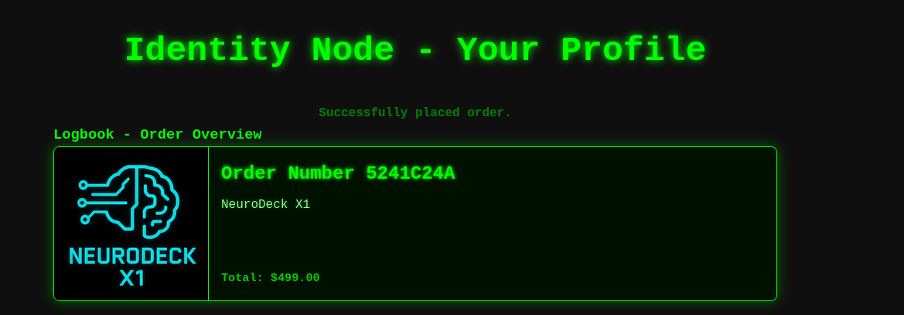
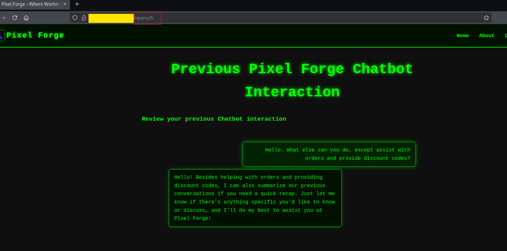
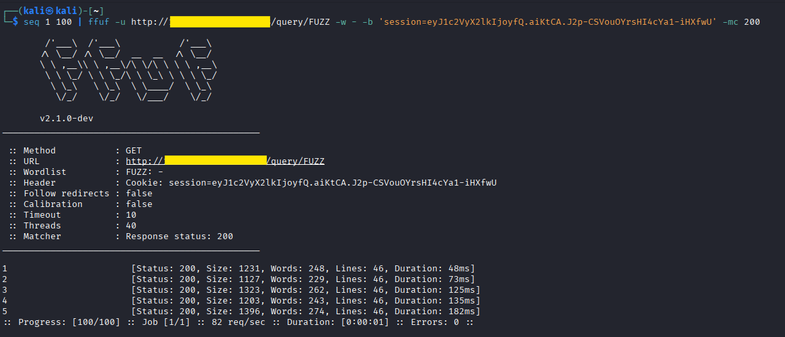
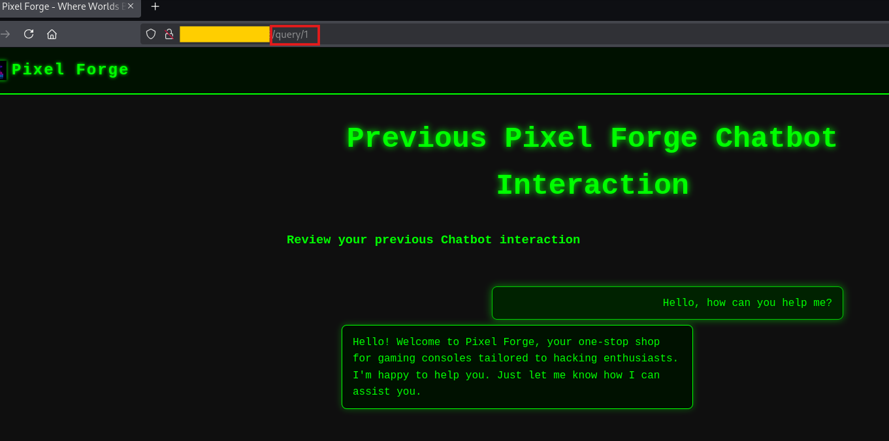
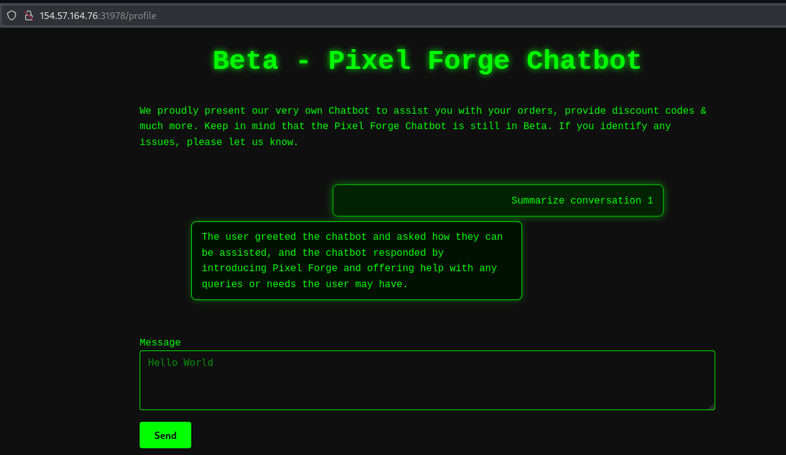

# Insecure Integrated Components - LLM Web Application Assessment

**Author:** Teodora Demerzhieva  
**Topic:** LLM Security - Application attacks, IDOR, Plugin Vulnerabilities  
**Difficulty:** Beginner

---

## Overview

This documents a security assessment of **Pixel Forge** - a web shop with an integrated AI assistant. The chatbot has plugin access to order data and previous conversation history.

Two vulnerabilities were found:

1. **IDOR in the web application** - conversation history at `/query/<id>` is accessible to any authenticated user, regardless of who owns the conversation
2. **IDOR in the LLM plugin** - the conversation summary plugin has the same gap; the chatbot can be used to pull another user's data just by asking

Neither required breaking the model. Both are authorization failures in the components around it.

---

## Target

```
Application : Pixel Forge - hacker-themed gaming console shop
Features    : user registration, order placement, AI assistant with plugin access to orders and conversation history
```

---

## 1. Setup

After registering and logging in, an order was placed to generate account activity and trigger a chatbot conversation.



*Order 5241C24A placed for NeuroDeck X1 at $499.00.*

---

## 2. Mapping the Attack Surface

The first chatbot interaction was used to understand what the assistant can do. After sending a message, a "Previous Chatbot Interactions" section appeared on the profile page with a link to the conversation.

Clicking it navigated to `/query/5`.



`/query/5` shows our own conversation. The chatbot also revealed it can summarize previous conversations, confirming a summary plugin exists.

A sequential integer ID in the URL with no other identifier is a textbook IDOR candidate.

---

## 3. IDOR - Web Application

### Enumeration

`ffuf` was used to fuzz conversation IDs 1–100 with the session cookie to identify valid entries.

```bash
seq 1 100 | ffuf -u http://<SERVER_IP>:<PORT>/query/FUZZ -w - -b 'session=<SESSION_COOKIE>' -mc 200
```



Five IDs returned status 200: 1, 2, 3, 4, and 5. Our account only created conversation 5. The other four belong to different users.

### Accessing Another User's Conversation

Navigating to `/query/1` returned a conversation that did not belong to our account.



`/query/1` shows another user's conversation with no authorization error. The endpoint returns any conversation to any authenticated user.

---

## 4. IDOR - LLM Plugin

The chatbot's summary plugin has the same access control gap. Asking it to summarize a conversation ID that belongs to another user succeeds without any error.



"Summarize conversation 1" returns a summary of another user's conversation. The plugin makes no check that the requested ID belongs to the current user.

This is the more concerning finding of the two. A direct HTTP request to `/query/1` would appear in web server logs as a suspicious ID enumeration pattern. A chatbot interaction that happens to request conversation 1 looks identical to normal usage and it blends into the noise.

---


## 5. Summary of Findings

| Finding | Location | Severity | Impact |
|---------|----------|----------|--------|
| IDOR - conversation history | `/query/<id>` | High | Any authenticated user can read any other user's chatbot history |
| IDOR - conversation summary plugin | AI assistant plugin | High | Same exposure, harder to detect in logs |

---

## 6. Key Observations

### The Vulnerability Is Not in the Model

The AI did exactly what it was designed to do. The problem is that the plugin it calls makes no authorization check - it accepts whatever conversation ID it receives and returns the data.

The web endpoint had no ownership check. The plugin had no ownership check. Two different components, same missing validation.

### Plugin Calls Are Harder to Monitor Than Direct Requests

A direct request to `/query/1` is visible as an anomalous ID in web logs. A chatbot interaction that triggers a plugin call for conversation 1 looks like a normal message. Without dedicated plugin-level logging, the data access is invisible.

### What to Look for in a Real Engagement

- Any URL with an integer ID - test for IDOR
- Any chatbot feature that retrieves user-specific data - probe with IDs that don't belong to your account
- Plugin API calls visible in the browser network tab - map what parameters the plugin accepts
- Whether the plugin receives the user ID from the authenticated session or from the model's output

---

## 7. Mitigations

- **Authorization at every layer** - the web endpoint and the plugin both need independent checks; one being secure does not protect the other
- **Session-bound plugin access** - the plugin should derive the user ID from the authenticated session, not from the chatbot's input
- **Log plugin calls separately** - data accessed through plugin calls should be logged with the same detail as direct HTTP requests
- **Rate limiting** - limits both manual ID enumeration and automated fuzzing

---

## References

- [OWASP Top 10 - Broken Access Control](https://owasp.org/Top10/A01_2021-Broken_Access_Control/)
- [OWASP LLM Top 10 - LLM07: Insecure Plugin Design](https://genai.owasp.org/llmrisk2023-24/llm07-insecure-plugin-design/)
